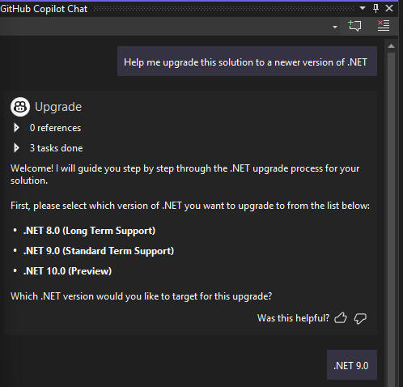
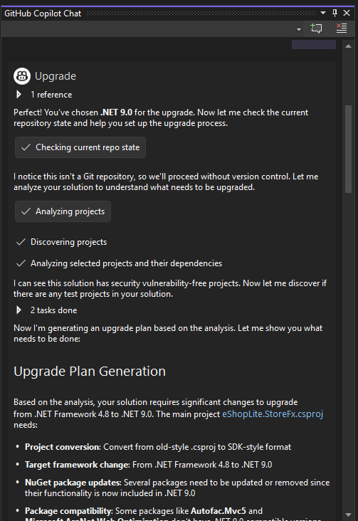
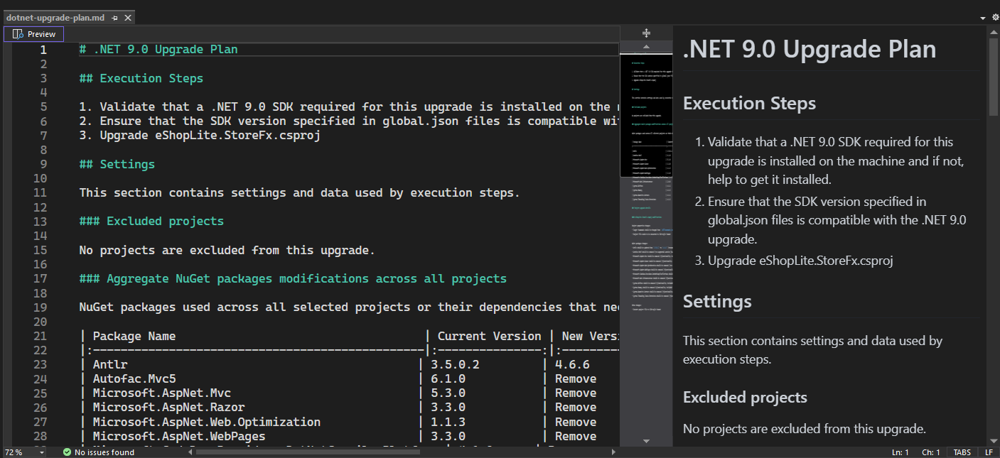
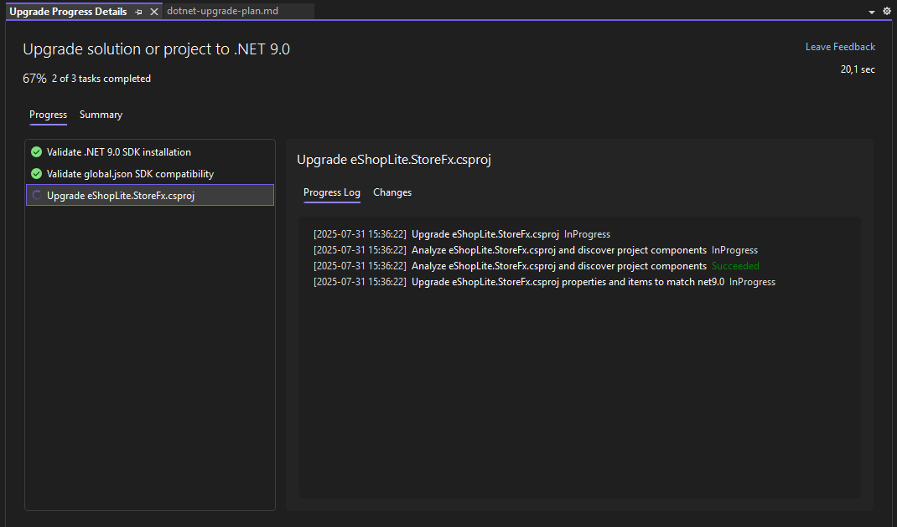
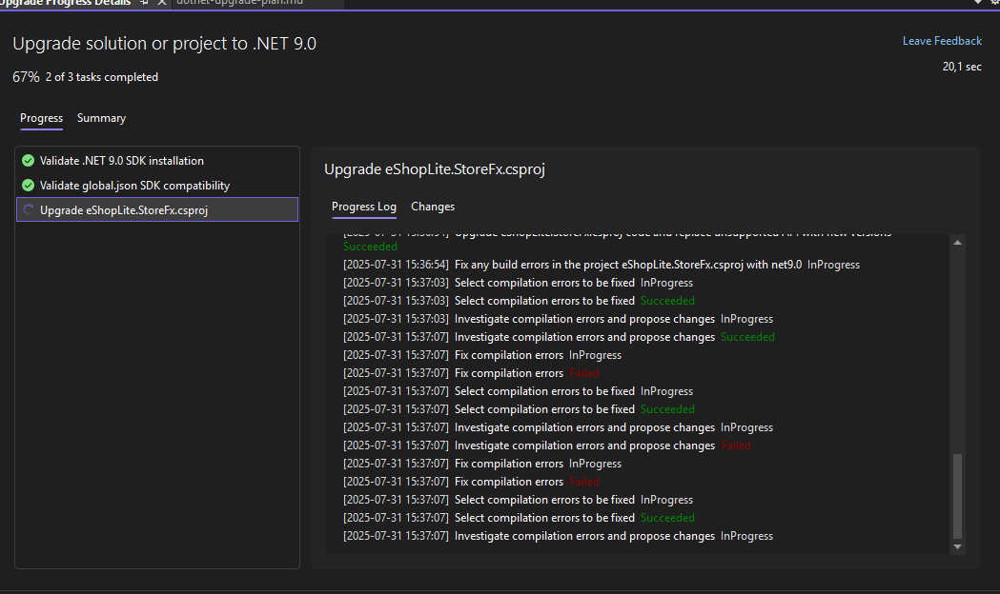
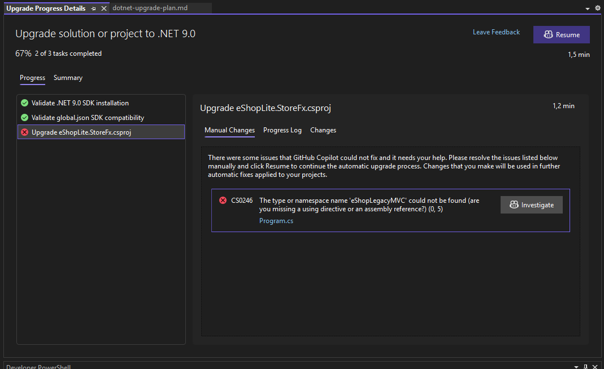
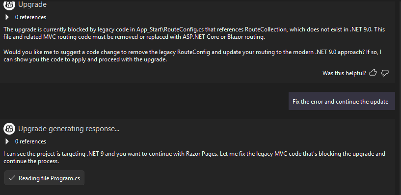
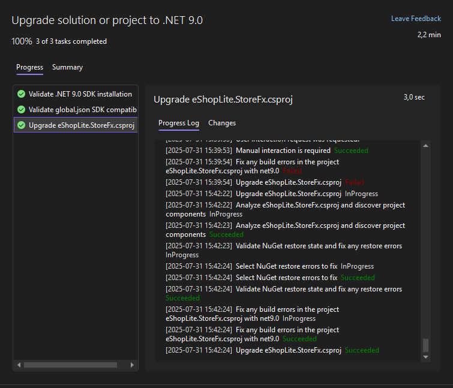
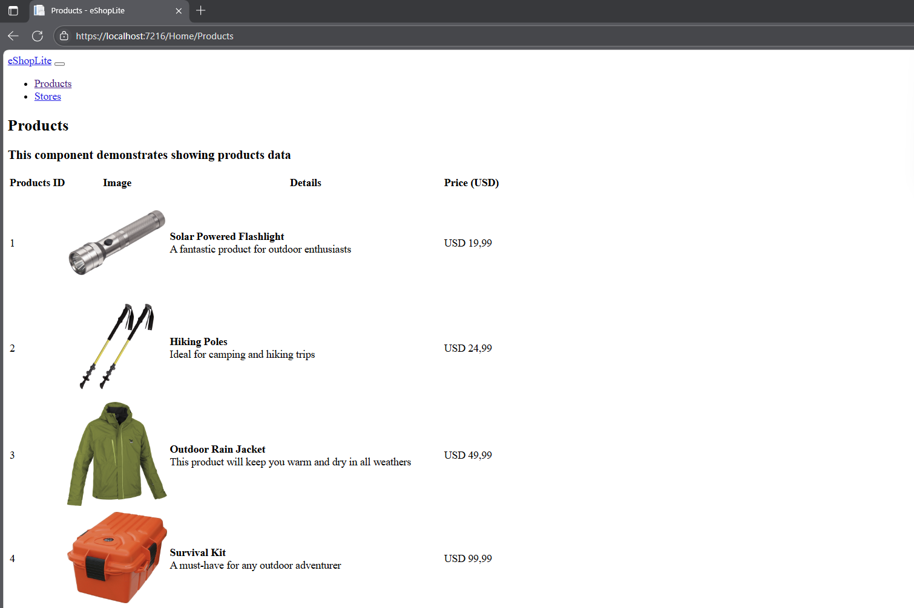
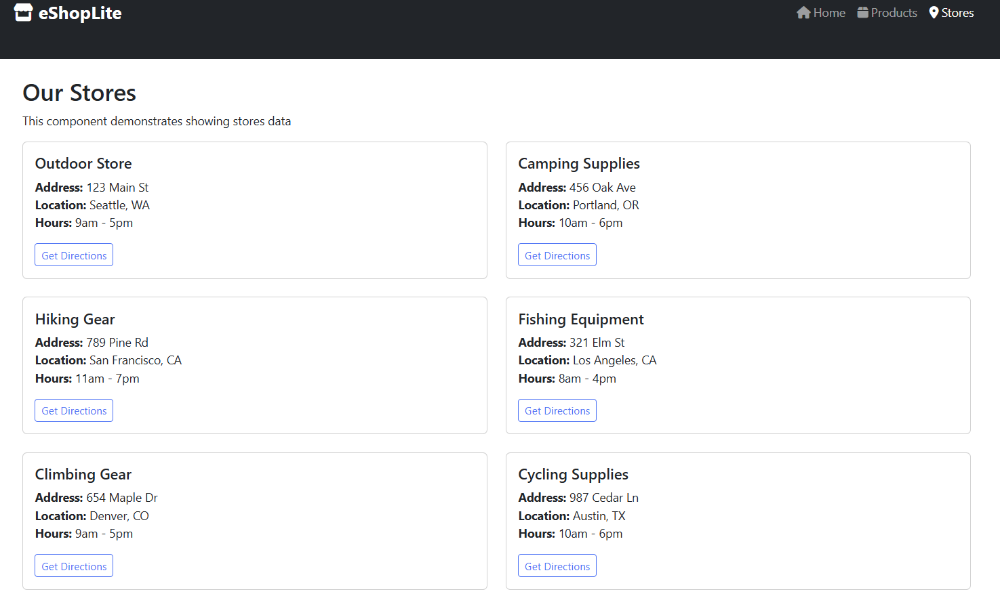

# 🚀 Modernize with GitHub Copilot

Let's explore an alternative approach to modernizing our eShopLite application using the GitHub Copilot Upgrade Assistant extension. 


This powerful tool leverages AI to automate and guide the modernization process, making it easier to upgrade not just the framework, but also transition to modern architectures and technologies.

## 📋 What You'll Do

This section covers:

🤖 Using GitHub Copilot for intelligent upgrades  
🔄 Migrating from .NET Framework to .NET 9  
💾 Transitioning from SQL Express to SQLite  
⚡ Converting MVC frontend to Blazor components  
🔧 Troubleshooting common migration issues  

## 🚨 Important Note

> **Warning**: If you're working locally, please copy the StartSample folder to another location before proceeding. The extension will attempt to create branches and git commits to save modifications as it progresses!

## 🤖 Getting Started with GitHub Copilot Modernization

In this tutorial, we'll modernize our application to achieve three major goals:
- Upgrade to .NET 9
- Migrate from SQL Express to SQLite
- Transform our MVC frontend to modern Blazor components

### Step 1: Initiate the Upgrade

1. Right-click on the solution in Solution Explorer
2. Select **"Upgrade with GitHub Copilot"**


This will open a chat interface with agent mode enabled for analysis.

### Step 2: Configure the Target Version

3. When prompted for the target version, select **.NET 9.0** and send the message in the chat



4. The tool will begin analyzing your project



### Step 3: Review and Enhance the Upgrade Plan

5. After analysis completes, a markdown file with the upgrade plan will be generated and will open in your editor. Review the plan carefully.



6. Scroll down in the markdown file and add the following requirements:

```markdown
- Update the front-end from the MVC to Blazor components
    - Take a look on the current front-end implementation
    - Recreate the components updating the design but keeping the same functionality
    - Ensure proper routing and navigation between components
    - Update any necessary services or APIs to support the new Blazor components
    - Remove any obsolete or unused code related to the old MVC front-end
    - Move scripts, images, and other assets to the new Blazor folder structure
- Transition from SQLExpress to SQLite
    - Update the database connection string in the appsettings.json file to use SQLite
    - Create a new SQLite database file and ensure it is included in the project
    - Migrate any existing data from SQLExpress to SQLite if necessary
    - Update any Entity Framework configurations to work with SQLite
```


7. Save the markdown file
8. Type in the Copilot chat window that it can continue with the upgrade


### Step 4: Monitor the Upgrade Process

The tool will now begin the automated upgrade process. During this phase:

- Files will be modified incrementally
- Git commits will be created for each major change
- Progress will be displayed in the chat interface



Here, you can see both the progress of the upgrade, any changes being made, and the current status of the migration.


It will progress and fail sometimes, but don't worry, this is normal. The AI will attempt to fix issues and continue the upgrade.



Sometimes, the tool will ask for some Manual Intervention, usually those can be ignored, as the files are still being modified in the background. You can investigate the errors using the  **"Investigate"** button, but most of the time, you can just continue with the upgrade clicking on the **"Resume"** button.



The Copilot Chat is also available to help you understand the changes being made and to provide context on any issues that arise. Plus, you can ask it to fix specific issues or provide more information about the changes.



After interacting with the Copilot, you can continue the upgrade process by clicking on the **"Resume"** button. When the upgrade is complete, you will see a message indicating that the upgrade has finished successfully.



### Step 5: Finalize the Migration

Usually, the upgrade will complete successfully, but if you encounter any issues, you can follow the troubleshooting steps below.

## 🔧 Handling Common Issues

### Error Recovery

Sometimes the tool may encounter errors during the upgrade. When this happens:

1. If you see an error message, click on **"Resume"** - in 70% of cases, the issue resolves in subsequent iterations.
2. If the error persists, type in the chatbox:
   ```
   Fix the errors and continue with the update
   ```

3. For specific errors, analyze the error message and debug with Copilot by providing context

### Frontend Migration Issues

The tool sometimes focuses primarily on backend work and may not fully complete the Blazor migration. 

This is our chance to refine the frontend, look our current implementation:




If pages aren't loading correctly, use this prompt:

```
Hey the pages are loading correctly, but the scripts that are in folders are not, could you check those to load on the pages. And we need to use Blazor pages, port to those! Do them step by step.
```

Usually, the Copilot will create a step-by-step plan to fix the issues and complete the migration. References, images, and other assets will be moved to the new Blazor folder structure, if not please check the folders and move them manually.

After some iterations and adjustments, you should see the Blazor components being created and the pages loading correctly.

Your page should now look like this:


### Database and Content Issues

If products or data aren't loading correctly after migration, use:

```
The products are not loading correctly, please check if the images and data are being seeded correctly, plus if the Razor pages are getting the information correctly. Think and do step-by-step
```

Sometimes, the problem is that Copilot did not do the database migration correctly, if so, you can fix it by:

1. Run the following command in the terminal to apply migrations:
```bash
dotnet ef migrations add InitialCreate
dotnet ef database update
```
2. Check if the database is created correctly and the data is seeded.

### Runtime Error Resolution

For runtime errors:
1. Stop debugging
2. Copy the error message
3. Paste it into the Copilot chat for analysis and resolution

## ✅ Verification

After all changes, run your application to verify:




Your application should now feature:
- ✅ Running on .NET 9
- ✅ Using SQLite instead of SQL Express
- ✅ Modern Blazor components replacing MVC views
- ✅ Improved performance and maintainability

## 🎯 What You've Accomplished

By using GitHub Copilot's modernization capabilities, you've:

🔹 Automated a complex multi-technology migration  
🔹 Leveraged AI to understand and transform your codebase  
🔹 Modernized both backend and frontend technologies  
🔹 Reduced manual migration effort significantly  

The combination of framework upgrade, database migration, and frontend transformation would typically take days or weeks of manual work, but with GitHub Copilot's assistance, you've accomplished it in a fraction of the time!

---
[← Previous: Modernize .NET Applications](../README.md) | [Next: Modernize with GitHub Copilot →](../../3-modernize-with-github-copilot/README.md)