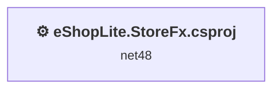
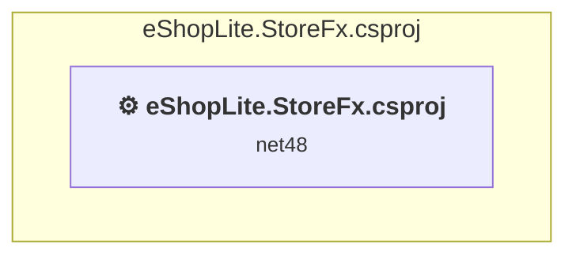

# Projects and dependencies analysis

This document provides a comprehensive overview of the projects and their dependencies in the context of upgrading to .NETCoreApp,Version=v10.0.

## Table of Contents

- [Executive Summary](#executive-Summary)
  - [Highlevel Metrics](#highlevel-metrics)
  - [Projects Compatibility](#projects-compatibility)
  - [Package Compatibility](#package-compatibility)
  - [API Compatibility](#api-compatibility)
  - [Binding Redirect Configuration](#binding-redirect-configuration)
- [Aggregate NuGet packages details](#aggregate-nuget-packages-details)
- [Top API Migration Challenges](#top-api-migration-challenges)
  - [Technologies and Features](#technologies-and-features)
  - [Most Frequent API Issues](#most-frequent-api-issues)
- [Projects Relationship Graph](#projects-relationship-graph)
- [Project Details](#project-details)

  - [eShopLite.StoreFx.csproj](#eshoplitestorefxcsproj)

## Executive Summary

### Highlevel Metrics

| Metric | Count | Status |
| :--- | :---: | :--- |
| Total Projects | 1 | All require upgrade |
| Total NuGet Packages | 0 | All compatible |
| Total Code Files | 16 |  |
| Total Code Files with Incidents | 9 |  |
| Total Lines of Code | 512 |  |
| Total Number of Issues | 115 |  |
| Estimated LOC to modify | 69+ | at least 13.5% of codebase |

### Projects Compatibility

| Project | Target Framework | Difficulty | Package Issues | API Issues | Binding Issues | Est. LOC Impact | Description |
| :--- | :---: | :---: | :---: | :---: | :---: | :---: | :--- |
| [eShopLite.StoreFx.csproj](#eshoplitestorefxcsproj) | net48 | 🔴 High | 17 | 69 | 18 | 69+ | Wap, Sdk Style = False |

### Package Compatibility

| Status | Count | Percentage |
| :--- | :---: | :---: |
| ✅ Compatible | 0 | 0.0% |
| ⚠️ Incompatible | 0 | 0.0% |
| 🔄 Upgrade Recommended | 0 | 0.0% |
| ***Total NuGet Packages*** | ***0*** | ***100%*** |

### API Compatibility

| Category | Count | Impact |
| :--- | :---: | :--- |
| 🔴 Binary Incompatible | 67 | High - Require code changes |
| 🟡 Source Incompatible | 2 | Medium - Needs re-compilation and potential conflicting API error fixing |
| 🔵 Behavioral change | 0 | Low - Behavioral changes that may require testing at runtime |
| ✅ Compatible | 303 |  |
| ***Total APIs Analyzed*** | ***372*** |  |

### Binding Redirect Configuration

| Severity | Count | Description |
| :--- | :---: | :--- |
| 🔴Mandatory | 8 | Must be fixed to avoid runtime failures |
| 🟡Potential | 10 | May cause issues in certain scenarios |
| ***Total Binding Issues*** | ***18*** | ***Across 1 project(s)*** |

## Aggregate NuGet packages details

| Package | Current Version | Suggested Version | Projects | Description |
| :--- | :---: | :---: | :--- | :--- |

## Top API Migration Challenges

### Technologies and Features

| Technology | Issues | Percentage | Migration Path |
| :--- | :---: | :---: | :--- |
| ASP.NET Framework (System.Web) | 69 | 100.0% | Legacy ASP.NET Framework APIs for web applications (System.Web.*) that don't exist in ASP.NET Core due to architectural differences. ASP.NET Core represents a complete redesign of the web framework. Migrate to ASP.NET Core equivalents or consider System.Web.Adapters package for compatibility. |

### Most Frequent API Issues

| API | Count | Percentage | Category |
| :--- | :---: | :---: | :--- |
| T:System.Web.Optimization.Bundle | 6 | 8.7% | Binary Incompatible |
| M:System.Web.Optimization.BundleCollection.Add(System.Web.Optimization.Bundle) | 5 | 7.2% | Binary Incompatible |
| M:System.Web.Optimization.Bundle.Include(System.String,System.Web.Optimization.IItemTransform[]) | 4 | 5.8% | Binary Incompatible |
| T:System.Web.Mvc.ActionResult | 3 | 4.3% | Binary Incompatible |
| T:System.Web.Mvc.ViewResult | 3 | 4.3% | Binary Incompatible |
| T:System.Web.Optimization.ScriptBundle | 3 | 4.3% | Binary Incompatible |
| M:System.Web.Optimization.ScriptBundle.#ctor(System.String) | 3 | 4.3% | Binary Incompatible |
| T:System.Web.Mvc.UrlParameter | 3 | 4.3% | Binary Incompatible |
| M:System.Web.Mvc.Controller.View(System.Object) | 2 | 2.9% | Binary Incompatible |
| P:System.Web.Mvc.ControllerBase.ViewBag | 2 | 2.9% | Binary Incompatible |
| M:System.Web.Mvc.Controller.#ctor | 2 | 2.9% | Binary Incompatible |
| T:System.Web.Optimization.BundleCollection | 2 | 2.9% | Binary Incompatible |
| T:System.Web.Mvc.GlobalFilterCollection | 2 | 2.9% | Binary Incompatible |
| T:System.Web.Routing.RouteCollection | 2 | 2.9% | Binary Incompatible |
| T:System.Web.Mvc.RouteCollectionExtensions | 2 | 2.9% | Binary Incompatible |
| M:System.Web.Mvc.Controller.View | 1 | 1.4% | Binary Incompatible |
| T:System.Web.Mvc.Controller | 1 | 1.4% | Binary Incompatible |
| T:System.Web.Optimization.StyleBundle | 1 | 1.4% | Binary Incompatible |
| M:System.Web.Optimization.StyleBundle.#ctor(System.String) | 1 | 1.4% | Binary Incompatible |
| M:System.Web.Optimization.Bundle.Include(System.String[]) | 1 | 1.4% | Binary Incompatible |
| M:System.Web.Optimization.Bundle.#ctor(System.String) | 1 | 1.4% | Binary Incompatible |
| T:System.Web.Mvc.HandleErrorAttribute | 1 | 1.4% | Binary Incompatible |
| M:System.Web.Mvc.HandleErrorAttribute.#ctor | 1 | 1.4% | Binary Incompatible |
| M:System.Web.Mvc.GlobalFilterCollection.Add(System.Object) | 1 | 1.4% | Binary Incompatible |
| T:System.Web.Optimization.BundleTable | 1 | 1.4% | Binary Incompatible |
| P:System.Web.Optimization.BundleTable.Bundles | 1 | 1.4% | Binary Incompatible |
| T:System.Web.Routing.RouteTable | 1 | 1.4% | Binary Incompatible |
| P:System.Web.Routing.RouteTable.Routes | 1 | 1.4% | Binary Incompatible |
| T:System.Web.Mvc.GlobalFilters | 1 | 1.4% | Binary Incompatible |
| P:System.Web.Mvc.GlobalFilters.Filters | 1 | 1.4% | Binary Incompatible |
| T:System.Web.Mvc.AreaRegistration | 1 | 1.4% | Binary Incompatible |
| M:System.Web.Mvc.AreaRegistration.RegisterAllAreas | 1 | 1.4% | Binary Incompatible |
| T:System.Web.Mvc.DependencyResolver | 1 | 1.4% | Binary Incompatible |
| M:System.Web.Mvc.DependencyResolver.SetResolver(System.Web.Mvc.IDependencyResolver) | 1 | 1.4% | Binary Incompatible |
| M:System.Web.HttpApplication.#ctor | 1 | 1.4% | Source Incompatible |
| T:System.Web.HttpApplication | 1 | 1.4% | Source Incompatible |
| F:System.Web.Mvc.UrlParameter.Optional | 1 | 1.4% | Binary Incompatible |
| T:System.Web.Routing.Route | 1 | 1.4% | Binary Incompatible |
| M:System.Web.Mvc.RouteCollectionExtensions.MapRoute(System.Web.Routing.RouteCollection,System.String,System.String,System.Object) | 1 | 1.4% | Binary Incompatible |
| M:System.Web.Mvc.RouteCollectionExtensions.IgnoreRoute(System.Web.Routing.RouteCollection,System.String) | 1 | 1.4% | Binary Incompatible |

## Projects Relationship Graph

Legend:
📦 SDK-style project
⚙️ Classic project

## Project Details

### eShopLite.StoreFx.csproj

#### Project Info

- **Current Target Framework:** net48
- **Proposed Target Framework:** net10.0
- **SDK-style**: False
- **Project Kind:** Wap
- **Dependencies**: 0
- **Dependants**: 0
- **Number of Files**: 87
- **Number of Files with Incidents**: 9
- **Lines of Code**: 512
- **Estimated LOC to modify**: 69+ (at least 13.5% of the project)

#### Dependency Graph

Legend:
📦 SDK-style project
⚙️ Classic project

### API Compatibility

| Category | Count | Impact |
| :--- | :---: | :--- |
| 🔴 Binary Incompatible | 67 | High - Require code changes |
| 🟡 Source Incompatible | 2 | Medium - Needs re-compilation and potential conflicting API error fixing |
| 🔵 Behavioral change | 0 | Low - Behavioral changes that may require testing at runtime |
| ✅ Compatible | 303 |  |
| ***Total APIs Analyzed*** | ***372*** |  |

#### Binding Redirect Configuration

| Rule | Severity | Details | Recommendation |
| :--- | :---: | :--- | :--- |
| Missing binding redirect for referenced assembly | 🟡Potential | Manual redirects exist but none covers EntityFramework (referenced v6.0.0.0, package v6.5.1) | Add a binding redirect for the missing assembly. |
| Missing binding redirect for referenced assembly | 🟡Potential | Manual redirects exist but none covers Microsoft.CodeDom.Providers.DotNetCompilerPlatform (referenced v4.1.0.0, package v4.1.0) | Add a binding redirect for the missing assembly. |
| Missing binding redirect for referenced assembly | 🟡Potential | Manual redirects exist but none covers System.Numerics.Vectors (referenced v4.1.6.0, package v4.6.1) | Add a binding redirect for the missing assembly. |
| Manual redirect conflicts with auto-generated version | 🔴Mandatory | Manual redirect for Newtonsoft.Json targets 13.0.0.0 but auto-generation would target 13.0.3 (MSB3836 conflict) | Remove the conflicting manual binding redirect or disable auto-generation. |
| Manual redirect conflicts with auto-generated version | 🔴Mandatory | Manual redirect for WebGrease targets 1.6.5135.21930 but auto-generation would target 1.6.0 (MSB3836 conflict) | Remove the conflicting manual binding redirect or disable auto-generation. |
| Manual redirect conflicts with auto-generated version | 🔴Mandatory | Manual redirect for System.Memory targets 4.0.5.0 but auto-generation would target 4.6.3 (MSB3836 conflict) | Remove the conflicting manual binding redirect or disable auto-generation. |
| Manual redirect conflicts with auto-generated version | 🔴Mandatory | Manual redirect for System.Threading.Tasks.Extensions targets 4.2.4.0 but auto-generation would target 4.6.3 (MSB3836 conflict) | Remove the conflicting manual binding redirect or disable auto-generation. |
| Manual redirect conflicts with auto-generated version | 🔴Mandatory | Manual redirect for Microsoft.Bcl.AsyncInterfaces targets 9.0.0.7 but auto-generation would target 9.0.7 (MSB3836 conflict) | Remove the conflicting manual binding redirect or disable auto-generation. |
| Manual redirect conflicts with auto-generated version | 🔴Mandatory | Manual redirect for System.Runtime.CompilerServices.Unsafe targets 6.0.3.0 but auto-generation would target 6.1.2 (MSB3836 conflict) | Remove the conflicting manual binding redirect or disable auto-generation. |
| Manual redirect conflicts with auto-generated version | 🔴Mandatory | Manual redirect for System.Buffers targets 4.0.5.0 but auto-generation would target 4.6.1 (MSB3836 conflict) | Remove the conflicting manual binding redirect or disable auto-generation. |
| Manual redirect conflicts with auto-generated version | 🔴Mandatory | Manual redirect for System.Diagnostics.DiagnosticSource targets 9.0.0.7 but auto-generation would target 9.0.7 (MSB3836 conflict) | Remove the conflicting manual binding redirect or disable auto-generation. |
| Binding redirect forces version downgrade | 🟡Potential | Binding redirect for Microsoft.Bcl.AsyncInterfaces targets 9.0.0.7 but package provides 9.0.7 | Update the binding redirect newVersion to match the version provided by the NuGet package. |
| Binding redirect forces version downgrade | 🟡Potential | Binding redirect for Newtonsoft.Json targets 13.0.0.0 but package provides 13.0.3 | Update the binding redirect newVersion to match the version provided by the NuGet package. |
| Binding redirect forces version downgrade | 🟡Potential | Binding redirect for System.Buffers targets 4.0.5.0 but package provides 4.6.1 | Update the binding redirect newVersion to match the version provided by the NuGet package. |
| Binding redirect forces version downgrade | 🟡Potential | Binding redirect for System.Diagnostics.DiagnosticSource targets 9.0.0.7 but package provides 9.0.7 | Update the binding redirect newVersion to match the version provided by the NuGet package. |
| Binding redirect forces version downgrade | 🟡Potential | Binding redirect for System.Memory targets 4.0.5.0 but package provides 4.6.3 | Update the binding redirect newVersion to match the version provided by the NuGet package. |
| Binding redirect forces version downgrade | 🟡Potential | Binding redirect for System.Runtime.CompilerServices.Unsafe targets 6.0.3.0 but package provides 6.1.2 | Update the binding redirect newVersion to match the version provided by the NuGet package. |
| Binding redirect forces version downgrade | 🟡Potential | Binding redirect for System.Threading.Tasks.Extensions targets 4.2.4.0 but package provides 4.6.3 | Update the binding redirect newVersion to match the version provided by the NuGet package. |

#### Project Technologies and Features

| Technology | Issues | Percentage | Migration Path |
| :--- | :---: | :---: | :--- |
| ASP.NET Framework (System.Web) | 69 | 100.0% | Legacy ASP.NET Framework APIs for web applications (System.Web.*) that don't exist in ASP.NET Core due to architectural differences. ASP.NET Core represents a complete redesign of the web framework. Migrate to ASP.NET Core equivalents or consider System.Web.Adapters package for compatibility. |

