# 🤖 Modernize with GitHub Copilot

By using GitHub Copilot from Chapter 2, our application is now running on .NET 10. But it may not be using best practices or design patterns.

In this chapter, we will focus on modernizing our application using GitHub Copilot, which will assist us in refactoring the codebase, improving architecture, and enhancing overall performance.

## 📋 What you'll do

This section explores:

🚀 AI-powered code modernization using **GitHub Copilot Modernization**  
💡 GitHub Copilot best practices
🔧 Automated refactoring suggestions  
📈 Improving code quality with AI assistance

## 🔍 Prerequisites

Before starting, ensure you have:

- GitHub Copilot installed and activated in Visual Studio
- Visual Studio 2022 17.14 or later with **GitHub Copilot modernization** enabled (built in as an optional component)

### Choose Your Starting Point

> ⚠️ **Important: Starting Sample Selection**
> 
> **If you completed Module 2B (GitHub Copilot Modernization upgrade):** You can continue with your upgraded code. Your Module 2B output should be running on .NET 10 with SQLite and Blazor components—perfect for modernization tasks in this module.
>
> **If you completed Module 2A (Traditional .NET Upgrade Assistant) or want a consistent baseline:** Use the fresh sample in **`3-modernize-with-github-copilot/StartSample`**. This ensures you have a stable, known starting point regardless of your Module 2 path. The StartSample is a post-upgrade .NET 10 codebase ready for architectural modernization.
>
> **Either path works.** Choose based on whether you want to keep your Module 2B progress or start fresh with a standardized baseline.

### Check GitHub Copilot agent mode

First, verify that the **upgrade_dotnet** tool is enabled in GitHub Copilot's Agent Mode:

1. Open Visual Studio and navigate to your solution
1. Open the GitHub Copilot chat window and switch to **Agent** mode
1. Click the icon that looks like a wrench and a screwdriver.
1. Ensure the **upgrade_dotnet** tool enabled

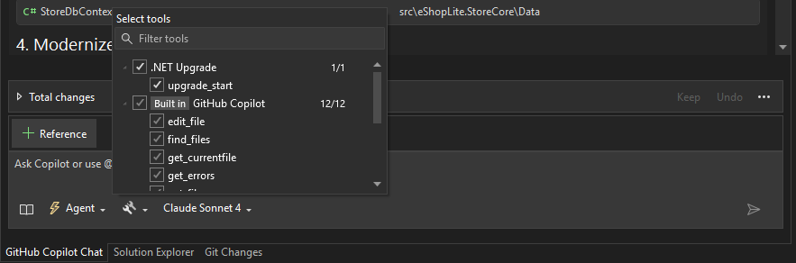

## How GitHub Copilot Modernization Works

GitHub Copilot's modernization tool follows a structured three-stage workflow: **Assessment → Planning → Execution**. First, it analyzes your codebase to identify upgrade opportunities and technical debt. Next, it creates a prioritized, step-by-step plan with proper dependency ordering. Finally, it implements changes incrementally, keeping your build green between steps.

You can start **GitHub Copilot modernization** in either of these ways:
- **Right-click the solution or project** in Solution Explorer and select **Modernize**
- Open **Copilot Chat** and type **`@Modernize`**

> ⚠️ **IMPORTANT**
>
> There is **no scenario picker UI** for .NET modernization. Start the Modernize agent, describe your goal in natural language, and Copilot maps your request to the right scenario and skills automatically.

| Official scenarios | Built-in skills relevant to this workshop |
| --- | --- |
| .NET version upgrade | EF6 → EF Core |
| SDK-style conversion | Dependency injection modernization |
| Newtonsoft.Json upgrade | MVC routing, views, and controllers |
| SqlClient upgrade | Newtonsoft.Json → System.Text.Json |
| Azure Functions upgrade | |
| Semantic Kernel to Agents | |

GitHub Copilot modernization also includes **30+ built-in skills** that load automatically when the agent detects matching code patterns. For this workshop, the most useful ones are **EF6 → EF Core**, **dependency injection modernization**, and **Newtonsoft.Json → System.Text.Json**.

### 🎛️ Guided vs. Automatic Mode

GitHub Copilot modernization runs in two workflow modes. Choose the one that fits your style:

| | Guided mode | Automatic mode |
|---|---|---|
| **How it works** | Pauses after Assessment, Planning, and at key decisions for your review | Runs through all stages without stopping (unless blocked) |
| **Best for** | Learning, workshops, first-time use, unfamiliar codebases | Routine upgrades, trusted patterns, speed |
| **Switch to it** | Say `"pause"` or `"switch to guided"` | Say `"continue"` or `"go ahead"` |

> 💡 **Recommendation**
>
> For this workshop, use **Guided** mode so you can inspect each stage and learn how Copilot structures modernization work.

Example prompts learners can try:
- `@Modernize Assess this solution and suggest the most relevant modernization work.`
- `@Modernize Help me upgrade EF6 to EF Core in this solution.`
- `@Modernize Replace Newtonsoft.Json with System.Text.Json.`
- `@Modernize What scenarios are available for this solution?`

### 🛠️ Custom Skills (Advanced)

For project-specific modernization patterns that go beyond the built-in scenarios and skills, you can create **custom upgrade skills** in your repository's `.github/skills/` folder. Each skill is a markdown file that teaches the Modernize agent a reusable pattern — for example, how your team wraps database calls or structures service layers.

> 💡 **TIP**
>
> Custom skills are optional and out of scope for this workshop. To learn more, see [Custom upgrade skills](https://learn.microsoft.com/dotnet/core/porting/github-copilot-app-modernization/custom-skills) in the official documentation.

## Starting the modernization process

Let's start the modernization by invoking the **GitHub Copilot modernization** agent. The **Assessment** stage analyzes your solution for modernization opportunities, the **Planning** stage creates a prioritized plan, and the **Execution** stage applies changes incrementally while keeping the solution stable.

1. Start the agent using either entry point:
   - **Right-click your solution** in Solution Explorer and select **Modernize**
   - Open **Copilot Chat**, enter **`@Modernize`**, and describe the result you want
2. Choose **Guided** mode when prompted so you can review each stage during the workshop

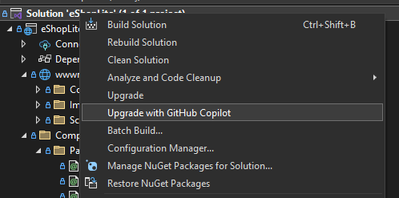

3. When Copilot asks for context, explain that the project is already on .NET 10. Because we completed the framework upgrade in the previous module, the goal here is to modernize the application's architecture and codebase rather than upgrade framework versions.

4. Paste the following comprehensive modernization request:

```plaintext
I am working on a project that has recently been upgraded from .NET Framework to .NET 10. I need help modernizing the architecture and refactoring the codebase to align with .NET 10 best practices. Please assist with the following tasks:

Namespace and Naming Consistency
Scan the entire solution for inconsistent or outdated namespace declarations. Identify and correct naming inconsistencies in classes, methods, and files. Apply consistent naming conventions throughout the codebase. The steps will be: Namespace and Naming Consistency, Fix Namespace Consistency - Models

Architecture Modernization
Refactor legacy architectural patterns to modern .NET 10 standards. Introduce dependency injection using Microsoft.Extensions.DependencyInjection. Replace obsolete or deprecated APIs with .NET 10-compatible alternatives. The steps will be: Modernize Data Layer with SQLite, Modernize Service Layer, Fix Controller Namespace and Modernize, Modernize Program.cs with .NET 10 Best Practices, Update Views to Handle Async Operations and New Namespaces, Create Error View

Database Migration
Replace the existing SQLExpress database with SQLite. Update connection strings and DbContext configuration to support SQLite. Migrate schema and seed data from SQLExpress to SQLite. Ensure all SQL queries are compatible with SQLite syntax. The steps will be: Update Configuration with SQLite Connection String, Create the database, Build and Test the Application
```

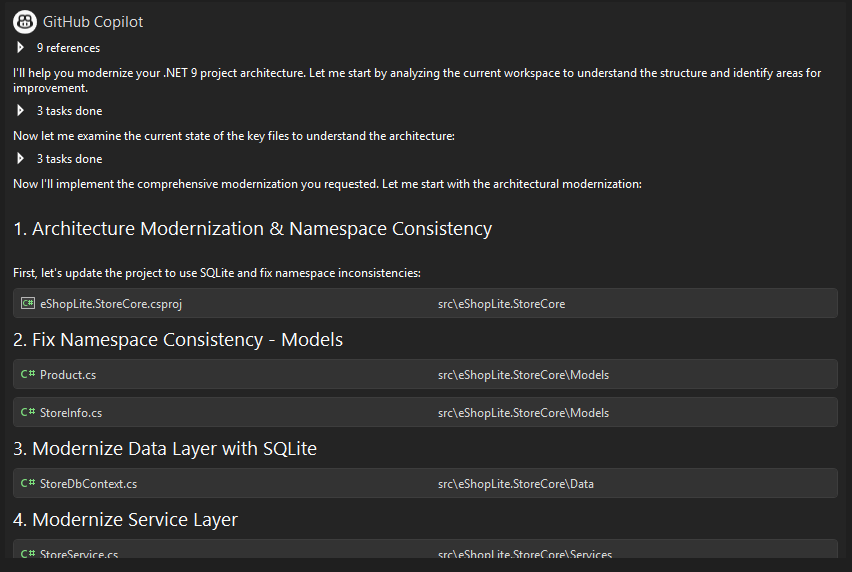

> 💡 **TIP**
>
> The modernization agent can map prompts like this one to its built-in scenarios and skills. Even if your request spans several tasks, Copilot can still suggest related work such as **EF6 → EF Core**, **dependency injection modernization**, or **Newtonsoft.Json → System.Text.Json** based on its assessment.

> 🪧**IMPORTANT**
>
> If the request stops in the middle of a task, you can always ask Copilot to continue by saying "continue" or "please continue."

## 📝 Modernization steps

GitHub Copilot will guide you through several modernization phases:

### 1️⃣ Namespace and naming consistency

Because of the older namespace structure from .NET Framework, we need to ensure that all namespaces and naming conventions are consistent in our application. For example, our models may have namespaces like `eShopLite.StoreFx.Models` instead of `eShopLite.StoreCore.Models`.

To achieve this, we added steps to Copilot analyze your codebase and suggest namespace corrections, before accepting any changes, please follow these steps:

- Review suggested namespace changes, you can accept or modify them as needed.
- Accept modifications to align with .NET 10 conventions and packages, such as going from `Newtonsoft.Json` to `System.Text.Json`.
- Ensure all models follow consistent naming patterns

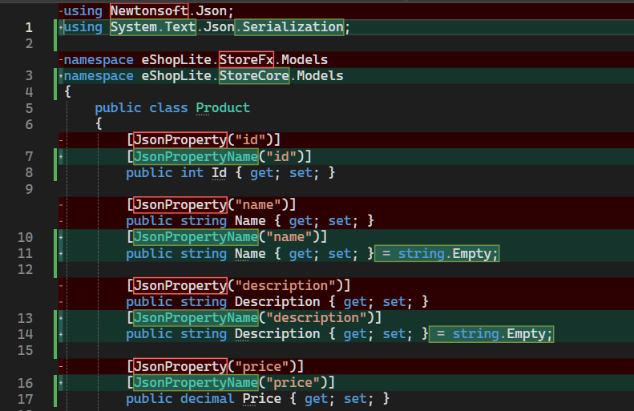

### 2️⃣ Architecture modernization

#### Modernize data layer with SQLite

We are transitioning from SQL Express using InMemory to SQLite, thus using a real database for persistence. Copilot will help transition from SQL Express to SQLite:

- Update Entity Framework Core packages
- Configure SQLite provider
- Adjust connection strings

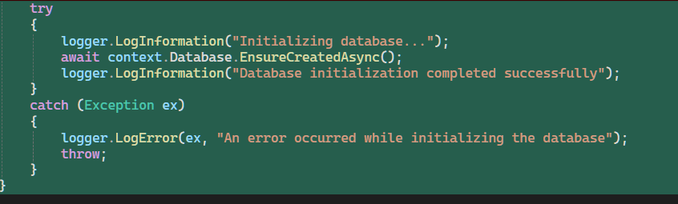

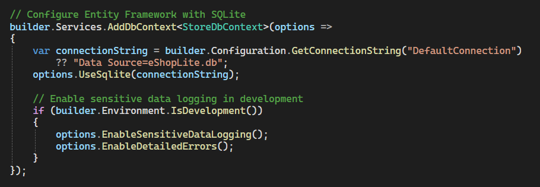

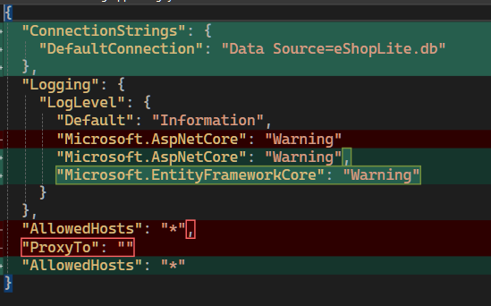

#### Dependency injection, async/await, modern routing

Transform services to use modern dependency injection patterns and update controllers with async/await patterns and modern routing:

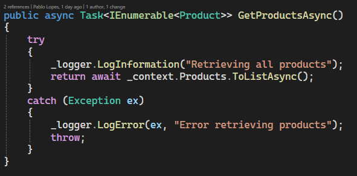

#### 3️⃣ Database migration

Copilot should automatically handle the database migration to SQLite, but if it doesn't, you can follow these steps:

1. Open a terminal in your project directory
2. Run the following commands:

```bash
cd eShopLite.StoreCore
dotnet ef migrations add InitialCreate
```

3. Now, build and run the application to ensure the database is created and seeded correctly.

## 🔧 Troubleshooting common issues

### YARP errors

If you encounter YARP (Yet Another Reverse Proxy) errors:
- Ask Copilot to remove YARP references from your project
- These are typically not needed for this application

### Missing images

If product images don't appear after modernization:
- Ask Copilot to reorganize static files within the `wwwroot` folder
- Ensure image paths are correctly referenced

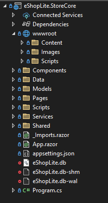

## 🎯 Build and test

After completing all modernization steps:

1. Build the solution to ensure no compilation errors
1. Run the application and verify all functionality
1. Check that:
   - Database operations work with SQLite
   - All pages load correctly
   - Images and static content display properly
   - Async operations complete successfully

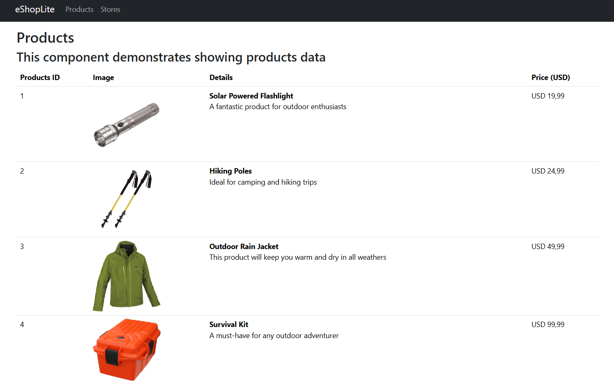

## 4️⃣ Convert to Blazor pages

Great, now we are ready continuing our modernization journey by converting the existing ASP.NET MVC pages to Blazor components. 

> 💡 **NOTE**  
> While the manual prompt below gives you hands-on control, you can also explore Copilot's automated help for this step by starting the **Modernize** agent and asking it to convert your MVC pages to Blazor components.

Use the following prompt to guide Copilot:

```plaintext
Convert the existing ASP.NET MVC pages to Blazor components. This includes:

Convert all existing pages to use Blazor (preferably Blazor Server or Blazor WebAssembly, depending on suitability).
Remove all non-Blazor pages and ensure routing is correctly configured.
Ensure all media (images, videos, etc.) are correctly referenced and rendered in the new Blazor components.
Fix issues where the page renders blank or fails to load due to routing or layout problems.
```

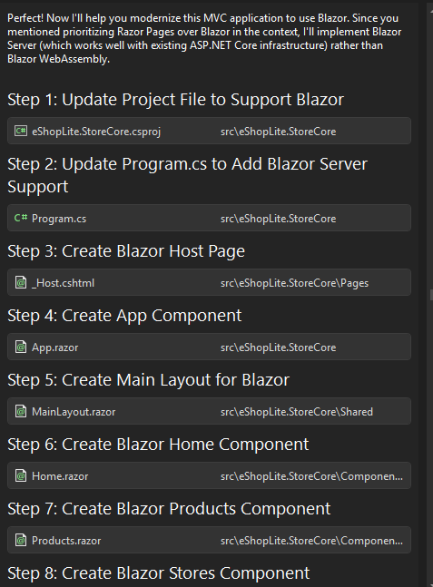

Copilot will convert the MVC pages to Blazor components, ensuring that all functionality is preserved and adding some new features.

> Note: If you encounter any issues with the Blazor migration, you can ask Copilot to help troubleshoot specific problems, such as missing components or routing errors.

This is our final page:

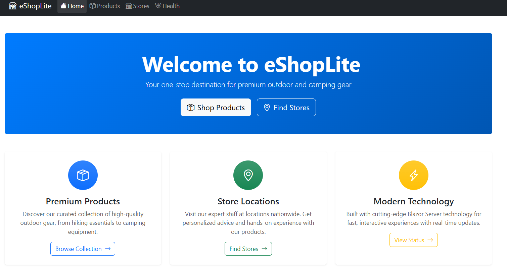

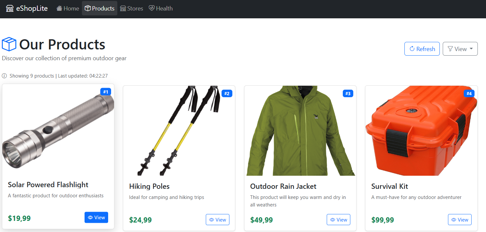

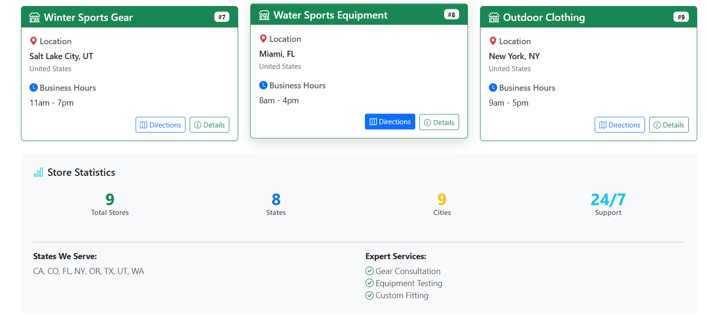


## ✅ Verification

By the end of this section, you should have:

🔹 Leveraged GitHub Copilot for code improvements  
🔹 Applied modern coding patterns  
🔹 Enhanced application performance and maintainability  

> **Next module preview:** Module 3 focuses on **code modernization** (patterns, APIs, language features). Module 4 continues with **architectural decomposition** — extracting microservices from the modernized codebase.

---
[← Previous: Upgrade .NET Applications](../2-upgrade-dotnet/2-upgrade-with-ghcp-modernization-app/README.md) | [Next: Refactor into Microservices →](../4-refactor-into-microservices/README.md)