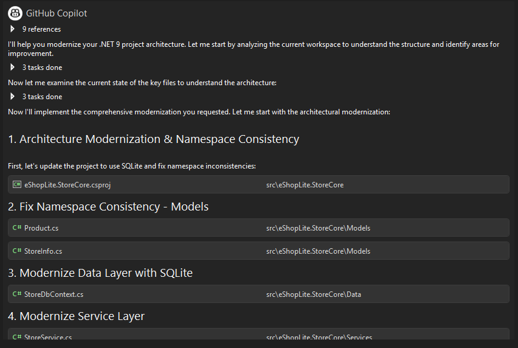
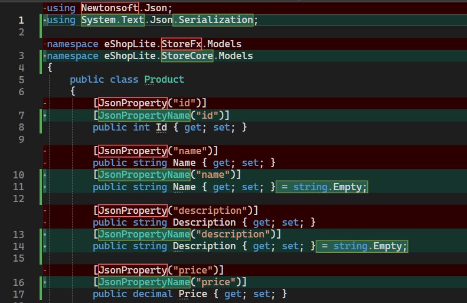
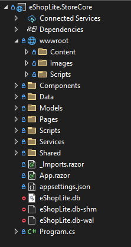
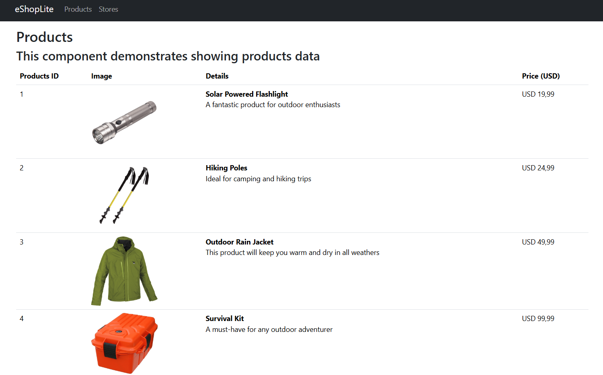

# 🤖 Modernize with GitHub Copilot

Discover how GitHub Copilot can accelerate your application modernization process with AI-powered code suggestions and refactoring assistance.

## 📋 What You'll Do

This section explores:

🚀 AI-powered code modernization  
💡 GitHub Copilot best practices  
🔧 Automated refactoring suggestions  
📈 Improving code quality with AI assistance  

## 📚 Instructions

Let's leverage GitHub Copilot to modernize our migrated eShopLite application, transforming it from a basic .NET Core port to a fully modernized .NET 9 application following current best practices.

### 🔍 Prerequisites

Before starting, ensure you have:
- GitHub Copilot installed and activated in Visual Studio
- The "migrate_dotnet" tool enabled in Agent Mode
- Your migrated eShopLite.StoreCore project from the previous section

### 🎯 Check GitHub Copilot Agent Mode

First, verify that the migrate_dotnet tool is enabled in GitHub Copilot's Agent Mode:

1. Open Visual Studio and navigate to your solution
2. Check the GitHub Copilot status in the bottom right corner
3. Ensure Agent Mode is active with the migrate_dotnet tool enabled


### 🚀 Starting the Modernization Process

1. **Right-click on your solution** in Solution Explorer
2. Select **"Upgrade with Copilot"** from the context menu


3. When prompted to select a version or provide context, paste the following comprehensive modernization request:

```
I am working on a project that has recently been upgraded from .NET Framework to .NET 9. I need help modernizing the architecture and refactoring the codebase to align with .NET 9 best practices. Please assist with the following tasks:

Namespace and Naming Consistency
Scan the entire solution for inconsistent or outdated namespace declarations. Identify and correct naming inconsistencies in classes, methods, and files. Apply consistent naming conventions throughout the codebase. The steps will be: Namespace and Naming Consistency, Fix Namespace Consistency - Models

Architecture Modernization
Refactor legacy architectural patterns to modern .NET 9 standards. Introduce dependency injection using Microsoft.Extensions.DependencyInjection. Replace obsolete or deprecated APIs with .NET 9-compatible alternatives. The steps will be: Modernize Data Layer with SQLite, Modernize Service Layer, Fix Controller Namespace and Modernize, Modernize Program.cs with .NET 9 Best Practices, Update Views to Handle Async Operations and New Namespaces, Create Error View

Database Migration
Replace the existing SQLExpress database with SQLite. Update connection strings and DbContext configuration to support SQLite. Migrate schema and seed data from SQLExpress to SQLite. Ensure all SQL queries are compatible with SQLite syntax. The steps will be: Update Configuration with SQLite Connection String, Create the database, Build and Test the Application
```



### 📝 Modernization Steps

GitHub Copilot will guide you through several modernization phases:

#### 1️⃣ Namespace and Naming Consistency

Copilot will analyze your codebase and suggest namespace corrections:


- Review suggested namespace changes
- Accept modifications to align with .NET 9 conventions
- Ensure all models follow consistent naming patterns



#### 2️⃣ Architecture Modernization

##### Modernize Data Layer with SQLite

Copilot will help transition from SQL Express to SQLite:


- Update Entity Framework Core packages
- Configure SQLite provider
- Adjust connection strings

##### Modernize Service Layer

Transform services to use modern dependency injection patterns:


##### Fix Controller Namespace and Modernize

Update controllers with async/await patterns and modern routing:


##### Modernize Program.cs

Refactor to use minimal hosting model and modern configuration:


##### Update Views

Ensure views are compatible with async operations:


##### Create Error View

Add proper error handling views:


#### 3️⃣ Database Migration

##### Update Configuration

Configure SQLite connection strings:


##### Create the Database

If Copilot fails to automatically create the database:

1. Open a terminal in your project directory
2. Run the following commands:

```bash
cd eShopLite.StoreCore
dotnet ef migrations add InitialCreate
dotnet ef database update
```


### 🔧 Troubleshooting Common Issues

#### YARP Errors

If you encounter YARP (Yet Another Reverse Proxy) errors:
- Ask Copilot to remove YARP references from your project
- These are typically not needed for this application


#### Missing Images

If product images don't appear after modernization:
- Ask Copilot to reorganize static files within the `wwwroot` folder
- Ensure image paths are correctly referenced



### 🎯 Build and Test

After completing all modernization steps:

1. Build the solution to ensure no compilation errors
2. Run the application and verify all functionality
3. Check that:
   - Database operations work with SQLite
   - All pages load correctly
   - Images and static content display properly
   - Async operations complete successfully



## ✅ Verification

By the end of this section, you should have:

🔹 Leveraged GitHub Copilot for code improvements  
🔹 Applied modern coding patterns  
🔹 Enhanced application performance and maintainability  

---
[← Previous: Migrate with .NET Upgrade Assistant](../2-migrate-with-dotnet-upgrade-assistant/README.md) | [Next: Refactor into Microservices →](../4-refactor-into-microservices/README.md)