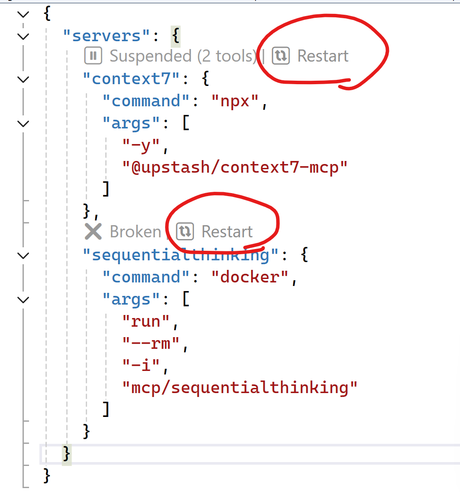
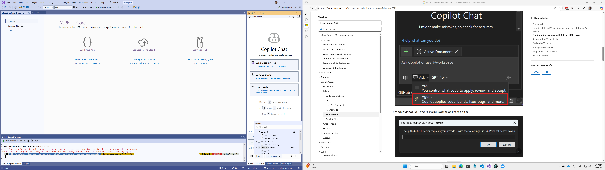
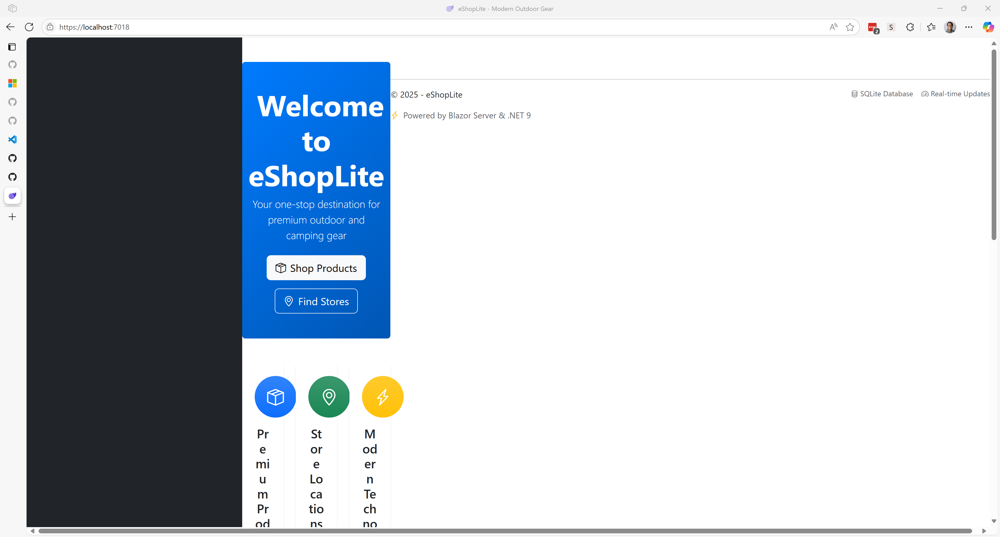
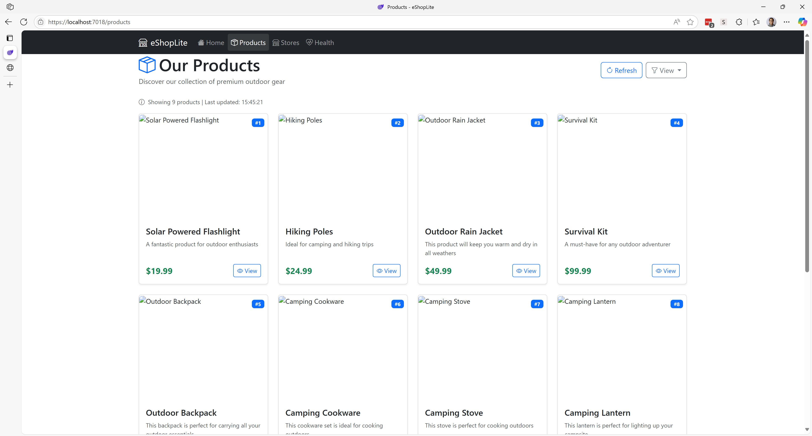

# 🏗️ Refactor into Microservices

Learn how to break down your monolithic application into focused, scalable microservices that can be developed, deployed, and maintained independently.

## 📋 What You'll Do

This section covers:

🔨 Microservices architecture patterns  
📦 Service decomposition strategies  
🔗 Inter-service communication  
🎯 Defining service boundaries  

## 📚 Instructions

While the `eShopLite.StoreCore` app has been refactored and modernized, there are still room to upgrade the Blazor app itself. Currently, the `eShopLite.StoreCore` uses Blazor Server App structure. Let's modernize it to Blazor Web App, using GitHub Copilot.

### 🔍 Prerequisites

Before starting, ensure you have:

- GitHub Copilot installed and activated in Visual Studio
- Your migrated eShopLite.StoreCore project from the previous section
- Docker Desktop is up and running

### 🎯 Add MCP Servers

1. First, add some useful MCP servers for modernization. Add a JSON file, `.mcp.json` directly under the solution. Then add the following two MCP servers - [`context7`](https://github.com/upstash/context7) and [`sequentialthinking`](https://github.com/modelcontextprotocol/servers/tree/main/src/sequentialthinking).

    ```jsonc
    // .mcp.json
    {
      "servers": {
        "context7": {
          "command": "npx",
          "args": [
            "-y",
            "@upstash/context7-mcp"
          ]
        },
        "sequentialthinking": {
          "command": "docker",
          "args": [
            "run",
            "--rm",
            "-i",
            "mcp/sequentialthinking"
          ]
        }
      }
    }
    ```

   Once you add this `.mcp.json` file, you'll be able to run both directly on the file. Click `start` or `restart` button.

   

### Modernize Blazor Server App to Blazor Web App

1. Add a new Blazor web app project to the solution. The new Blazor web app project is `eShopLite.Store`.
1. Make sure you've included both `context7` and `sequentialthinking` MCP servers as tools.

   

1. Enter the following prompt for migration.

    ```text
    Here's the current Blazor app, `eShopLite.StoreCore`. I'd like to migrate this app to `eShopLite.Store`. Here are my instructions for you to follow:
    
    - Use `context7` and `sequentialthinking` MCP servers.
    - Migrate `eShopLite.StoreCore` to `eShopLite.Store`.
    - Keep the layout unchanged.
    - Keep the CSS style unchanged.
    - Keep the JS interaction unchanged.
    ```

1. GitHub Copilot starts the migration process. It might ask you to continue from time to time. You can manually handle it or allow to continue without asking.
1. GitHub Copilot sometimes stops progressing and wait for you to enter additional prompt. In that case, enter one of the following prompts until it completes the whole migration.

    ```text
    Keep continuing
    Continue
    Please go for it
    ```

1. Once the migration is complete, run the `eShopLite.Store` application to verify whether the layout is broken or not. If the layout is broken like the image below, add the screenshot to Visual Studio as additional context and enter the following prompt to rectify it.

   

    ```text
    When I run the app, the layout is completely broken. Find the issue and fix it.
    ```

   If there are other layout issues found, iterate it. Here's an example:

   

    ```text
    All the product images are missing. Find the issue and fix it.
    ```

1. Once all the fix is complete run the `eShopLite.Store` app and verify everything works as expected.
1. Modernization to Blazor Web App has now been complete.

Althouth the `eShopLite.Store` app has been modernized, it is still monolith. For the app to be more cloud-native, let's divide the `eShopLite.Store` app into three &ndash; the existing `eShopLite.Store` still takes care of the UI frontend part, but the product data and store location data are running as separate API apps. GitHub Copilot makes this monolith app into microservice apps way easier.

### Separate `eShopLite.Products` and `eShopLite.StoreInfo` from `eShopLite.Store`

1. In a new GitHub Copilot Chat, make sure it's the agent mode.
1. Make sure both `context7` and `sequentialthinking` MCP servers are up and running, and included as tools.
1. Add two ASP.NET Core Web API projects called `eShopLite.Products` and `eShopLite.StoreInfo`.

*Detailed microservices refactoring instructions will be added here.*

## ✅ Verification

By the end of this section, you should have:

🔹 Decomposed monolith into logical microservices  
🔹 Implemented proper service boundaries  
🔹 Established communication patterns between services  

---
[← Previous: Modernize with GitHub Copilot](../3-modernize-with-github-copilot/README.md) | [Next: Add .NET Aspire →](../5-add-dotnet-aspire/README.md)