# ☁️ Deploy to Azure Container Apps with Aspire CLI

Deploy your modernized microservices to Azure Container Apps using the Aspire CLI for a production-ready, scalable cloud deployment.

## 📋 What You'll Do

This section demonstrates:

🚀 Aspire CLI deployment workflow  
📦 Container Apps deployment  
🔎 Resource inspection with `aspire describe`  
📤 Diagnostics export with `aspire export`  

## 📚 Instructions

### Replacing databases with PostgreSQL containers

Currently both **eShopLite.Products** and **eShopLite.StoreInfo** API apps use SQLite database. It's simple and easy to use but tricky when it faces to the cloud-native context due to the scalability. We need to change this database to something else.

Aspire makes it very easy to add a database to your applications. Many SQL-compliant database are already available as Aspire integrations. In this lab, we will replace the existing SQLite database with PostgreSQL database.

1. Open the eShopLite solution from the **7-deploy-to-aca/StartSample** folder.
1. Right click on the project **eShopLite.AppHost** and select  **Add > .NET Aspire Package.**

   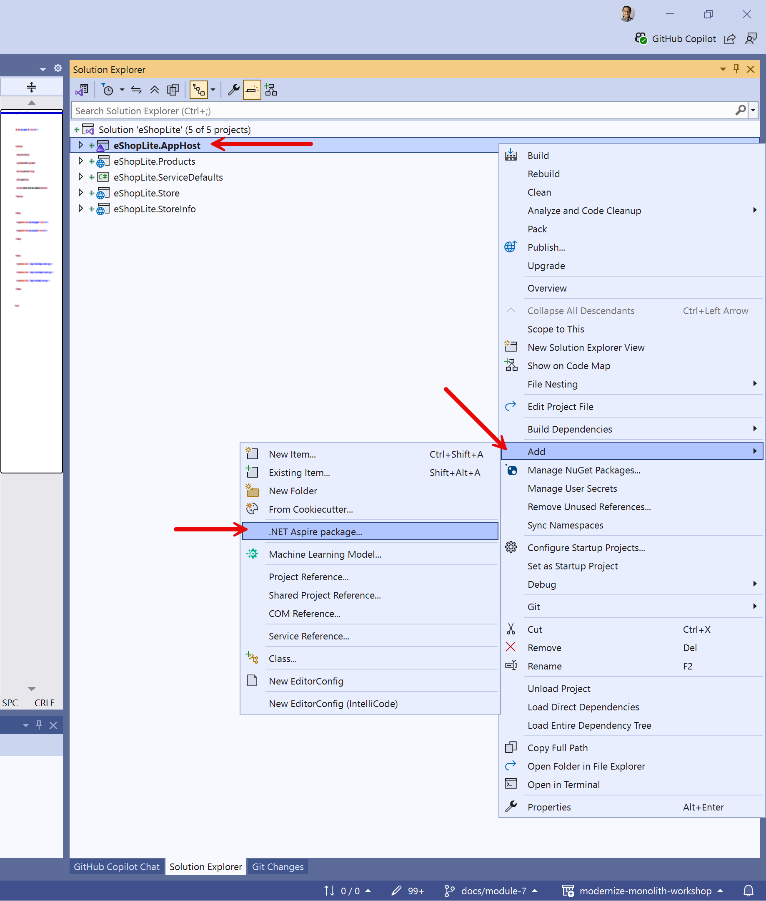

1. In the search bar, at the top left of the Nuget Package Manager, type **postgresql**. Select the  **Aspire.Hosting.PostgreSQL** package and click the install button.

   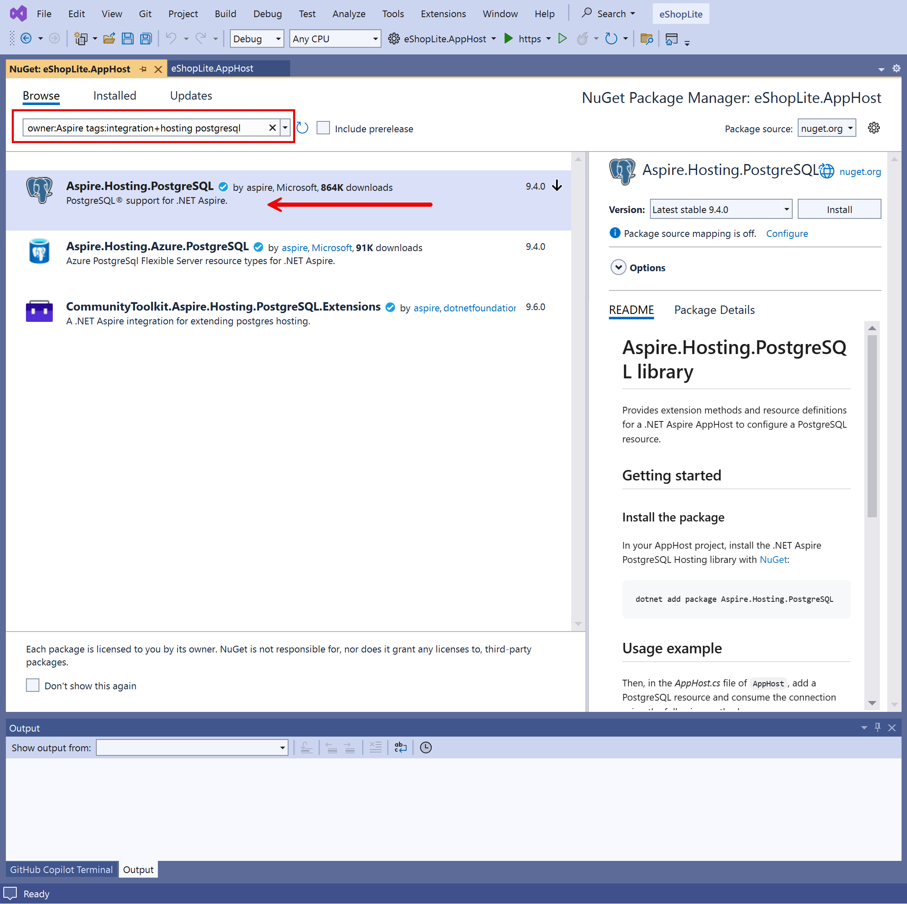

1. Open the **AppHost.cs** file from the **eShopLite.AppHost** project.
1. Right beneath the builder, let's create a database and passes it to the product API by updating the code. Here save the resource in the variable `productsdb`, and pass it to the `products` using the `WithReference` method.

    ```csharp
    var productsdb = builder.AddPostgres("pg-products")
                            .AddDatabase("productsdb");

    var products = builder.AddProject<Projects.eShopLite_Products>("eshoplite-products")
                          // 👇👇👇 Add 👇👇👇
                          .WithReference(productsdb)
                          .WaitFor(productsdb);
                          // 👆👆👆 Add 👆👆👆
    ```

   Now, create a `storeinfodb` resource instance and integrate it with the `storeinfo` resource instance, by following the same approach as above.

    ```csharp
    var storeinfodb = builder.AddPostgres("pg-storeinfo")
                             .AddDatabase("storeinfodb");

    var storeinfo = builder.AddProject<Projects.eShopLite_StoreInfo>("eshoplite-storeinfo")
                           // 👇👇👇 Add 👇👇👇
                           .WithReference(storeinfodb)
                           .WaitFor(storeinfodb);
                           // 👆👆👆 Add 👆👆👆
    ```

1. Some of the Aspire database integrations also allow you to create a container for database management tools. To add **PgAdmin** to your solution to manage the PostgreSQL database, use this code:

    ``` csharp
    var productsdb = builder.AddPostgres("pg-products")
                            // 👇👇👇 Add 👇👇👇
                            .WithPgAdmin()
                            // 👆👆👆 Add 👆👆👆
                            .AddDatabase("productsdb");
    ```

   Add this PgAdmin tool to the **pg-storeinfo** database as well.

The advantage of letting Aspire create the container is that you don't need to do any configuration to connect PgAdmin to the PostgreSQL database, it's all automatic. Let's configure the API apps to replace SQLite with PostgreSQL.

## Configuring API apps to use PostgreSQL databases

1. Right click on the project **eShopLite.Products** and select  **Add > .NET Aspire Package**.

   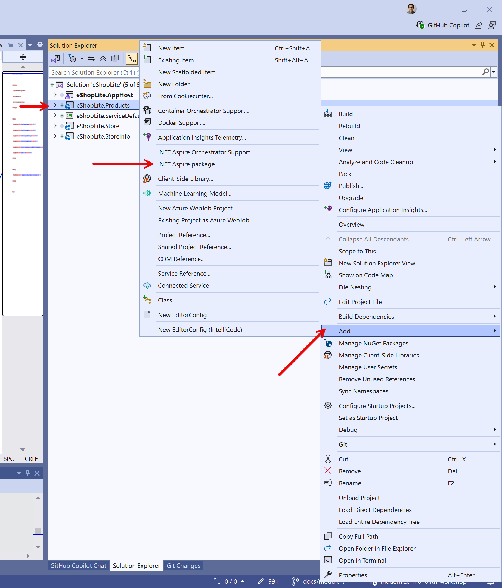

1. In the search bar, at the top left of the Nuget Package Manager, type **postgresql**. Select the **Aspire.Npgsql.EntityFrameworkCore.PostgreSQL** package and click the install button. We are using this one because the solution uses Entity Framework.

   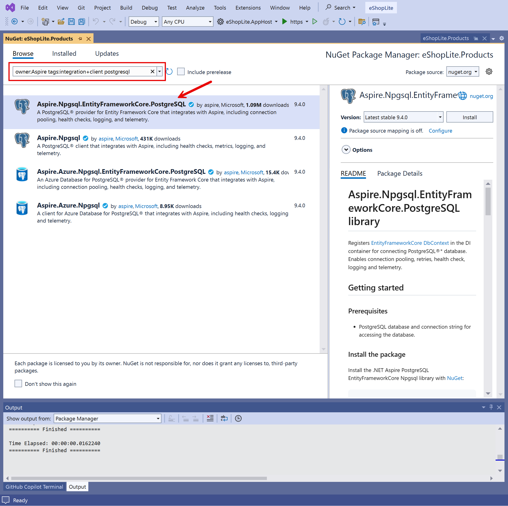

   > **NOTE**: There might be error occurring while installing the NuGet package due to the version mismatch. In this case, update all existing NuGet packages to the newest version and install the PostgreSQL package again.

1. Open the **Program.cs** from the **eShopLite.Products** project and update database context.

    ```csharp
    // Before
    builder.Services.AddDbContext<ProductDbContext>(options =>
    {
        var connectionString = builder.Configuration.GetConnectionString("DefaultConnection") 
            ?? "Data Source=products.db";
        options.UseSqlite(connectionString);
        
        // Enable sensitive data logging in development
        if (builder.Environment.IsDevelopment())
        {
            options.EnableSensitiveDataLogging();
            options.EnableDetailedErrors();
        }
    });

    // After
    builder.AddNpgsqlDbContext<ProductDbContext>("productsdb", configureDbContextOptions: options =>
    {
        // Enable sensitive data logging in development
        if (builder.Environment.IsDevelopment())
        {
            options.EnableSensitiveDataLogging();
            options.EnableDetailedErrors();
        }
    });
    ```

   Note that we use **productsdb** as the database connection reference, which was declared in **AppHost.cs** of the **eShopLite.AppHost** project.

   Now, add the same **Aspire.Npgsql.EntityFrameworkCore.PostgreSQL** package to the **eShopLite.StoreInfo** project and configure it as well, using the **storeinfodb** reference.

    ```csharp
    // Before
    builder.Services.AddDbContext<StoreInfoDbContext>(options =>
    {
        var connectionString = builder.Configuration.GetConnectionString("DefaultConnection") 
            ?? "Data Source=storeinfo.db";
        options.UseSqlite(connectionString);
        
        // Enable sensitive data logging in development
        if (builder.Environment.IsDevelopment())
        {
            options.EnableSensitiveDataLogging();
            options.EnableDetailedErrors();
        }
    });

    // After
    builder.AddNpgsqlDbContext<StoreInfoDbContext>("storeinfodb", configureDbContextOptions: options =>
    {
        // Enable sensitive data logging in development
        if (builder.Environment.IsDevelopment())
        {
            options.EnableSensitiveDataLogging();
            options.EnableDetailedErrors();
        }
    });
    ```

1. Remove duplicated health check endpoint from each API app, defined in `Program.cs` because Aspire PostgreSQL integration automatically takes care of it.

    ```csharp
    // 👇👇👇 Remove from eShopLite.Products 👇👇👇
    // Add health checks
    builder.Services.AddHealthChecks()
        .AddDbContextCheck<ProductDbContext>();
    // 👆👆👆 Remove from eShopLite.Products 👆👆👆
    ```

    ```csharp
    // 👇👇👇 Remove from eShopLite.StoreInfo 👇👇👇
    // Add health checks
    builder.Services.AddHealthChecks()
        .AddDbContextCheck<StoreInfoDbContext>();
    // 👆👆👆 Remove from eShopLite.StoreInfo 👆👆👆
    ```

### Verifying the database changes on Aspire dashboard

Let's test it:

1. Make sure Docker Desktop is up and running before running this Aspire application.
1. In Visual Studio, to start the app, press `F5` or **select Debug > Start Debugging**.
1. When the Aspire dashboard appears, note the you have many more resources.

   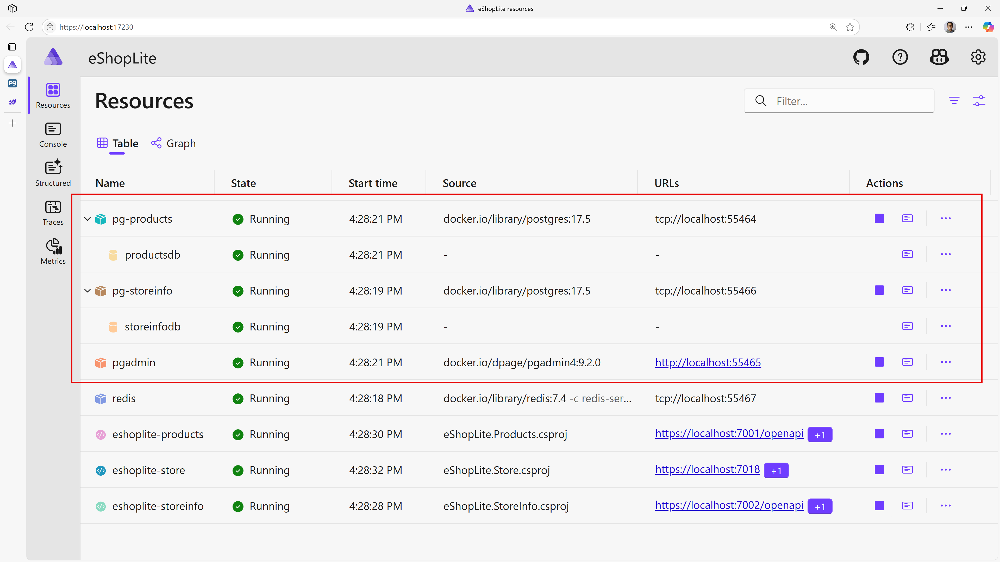

   > **NOTE**: You may be asked to enter an authentication token to access to the dashboard.
   >
   > 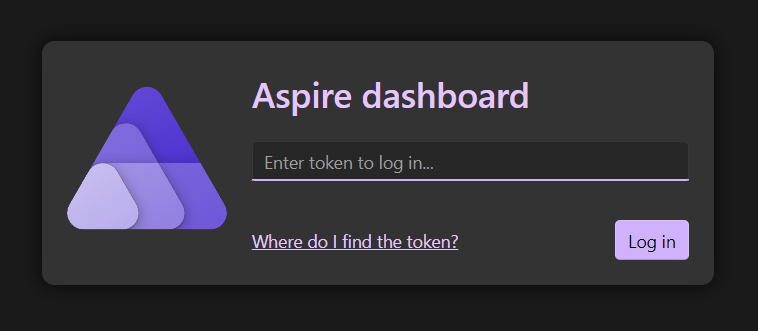
   >
   > The token can be found in the terminal console. Copy and paste it to the field and click "Log in".
   >
   > 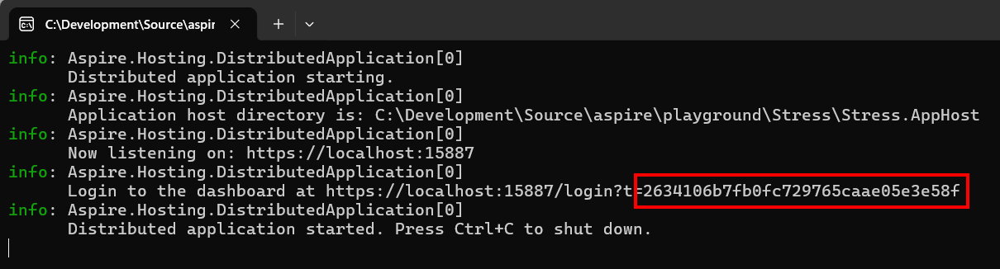

1. Click on the **pgadmin** resource, a new tab will open with the pgAdmin website. It can takes a few seconds to completely load.
1. From the pgAdmin website, you manage both **products** and **storeinfo** databases. For example, to visualize the products table, expand the **Servers > pg-products > Databases > productsdb > Schemas > Tables**.

   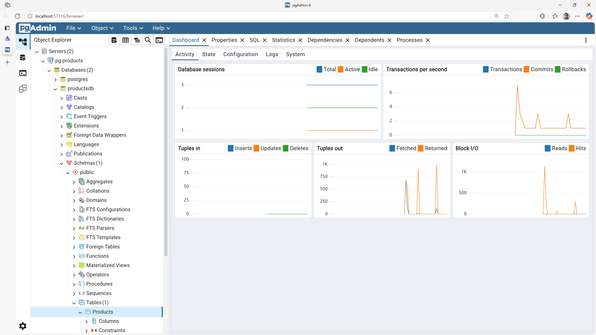

1. You can see all the rows by right-clicking on the **Products** table and selecting **View/Edit Data > All Rows**.

   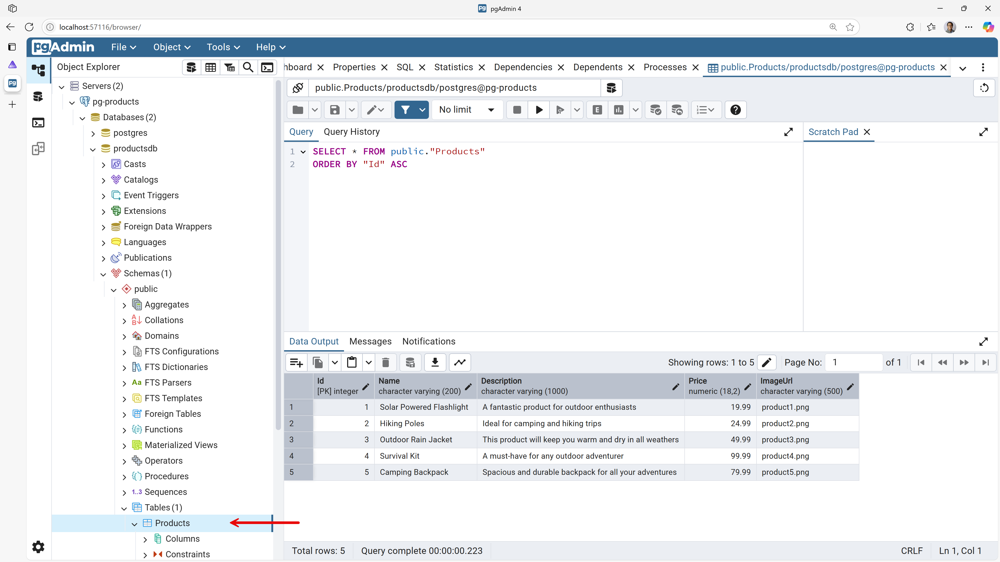

1. Now go back the the Aspire dashboard, click on **eshoplite-store** the endpoints, a new tab will open with the store website.
1. The store works like before but now uses a PostgreSQL database in a container.
1. Close the web browser to stop debugging the applications.

### Deploying all apps to Azure using Aspire CLI

Aspire can now handle the Azure Container Apps deployment flow directly from the AppHost. Instead of generating `azd` scaffolding, you add the Azure Container Apps hosting package, declare an Azure Container Apps environment in code, and let the Aspire CLI publish and deploy the whole application graph.

1. Open Windows Terminal.
1. Navigate to the **7-deploy-to-aca/StartSample** directory in the terminal.
1. Make sure the Aspire CLI and Azure CLI are installed.

    ```powershell
    # Install the Aspire CLI if it's not already available with your .NET 10 SDK
    dotnet tool install -g aspire
    ```

    ```powershell
    # Sign in to Azure
    az login
    ```

    > **NOTE**:
    >
    > - Recent .NET 10 SDK installs already include the Aspire CLI.
    > - If `aspire --version` works, you can skip the install command.

1. Add Azure Container Apps deployment support to the AppHost.

    ```powershell
    aspire add azure-appcontainers
    ```

    The command adds the **Aspire.Hosting.Azure.AppContainers** package to the **eShopLite.AppHost** project. Choose the package version that matches the rest of your Aspire packages.

1. Open **AppHost.cs** from the **eShopLite.AppHost** project.
1. Add an Azure Container Apps environment near the top of the file, and keep the store app exposed with `.WithExternalHttpEndpoints()` so the front end is reachable from the Internet.

    ```csharp
    var builder = DistributedApplication.CreateBuilder(args);
    builder.AddAzureContainerAppEnvironment("env");

    var productsdb = builder.AddPostgres("pg-products")
                            .WithPgAdmin()
                            .AddDatabase("productsdb");

    var storeinfodb = builder.AddPostgres("pg-storeinfo")
                             .WithPgAdmin()
                             .AddDatabase("storeinfodb");

    var redis = builder.AddRedis("redis");

    var products = builder.AddProject<Projects.eShopLite_Products>("eshoplite-products")
                          .WithReference(productsdb)
                          .WaitFor(productsdb);

    var storeinfo = builder.AddProject<Projects.eShopLite_StoreInfo>("eshoplite-storeinfo")
                           .WithReference(storeinfodb)
                           .WaitFor(storeinfodb);

    builder.AddProject<Projects.eShopLite_Store>("eshoplite-store")
           .WithExternalHttpEndpoints()
           .WithReference(products)
           .WithReference(storeinfo)
           .WithReference(redis)
           .WaitFor(products)
           .WaitFor(storeinfo)
           .WaitFor(redis);

    builder.Build().Run();
    ```

    `AddAzureContainerAppEnvironment("env")` tells Aspire which compute environment to target during publish and deploy.

1. Deploy the AppHost.

    ```powershell
    aspire deploy
    ```

    Aspire will inspect the current folder, find the AppHost, build the application, publish container images, provision the Azure Container Apps environment, and deploy the resources.

1. During `aspire deploy`, answer the interactive Azure prompts.

    - Select the Azure subscription you want to use.
    - Choose the Azure location for the deployment, such as `eastus`.
    - Enter the resource group name to create or reuse, such as `eshoplite-aca-demo`.

    > **NOTE**: In CI/CD or scripted runs, you can avoid these prompts by setting `Azure__SubscriptionId`, `Azure__Location`, and `Azure__ResourceGroup` before running `aspire deploy`.

1. Wait for the deployment to finish. This can take several minutes while Aspire builds images and provisions Azure resources.
1. Once the deployment is over, go to the Azure Portal and navigate to the resource group you selected. You should find the Azure Container Apps resources that Aspire created for the app.

   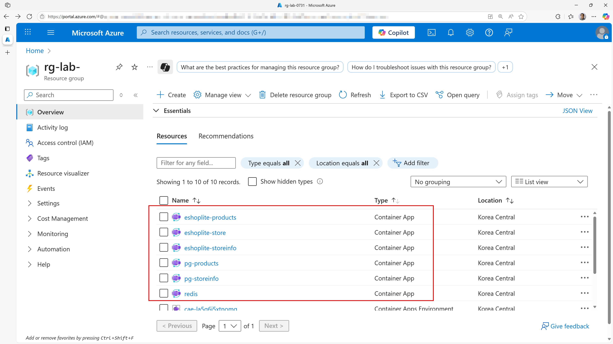

1. Click the Container Apps instance, **redis**, and notice that the **Application Url** value has the word **internal** in it. This indicates the resource is NOT exposed to the Internet.

   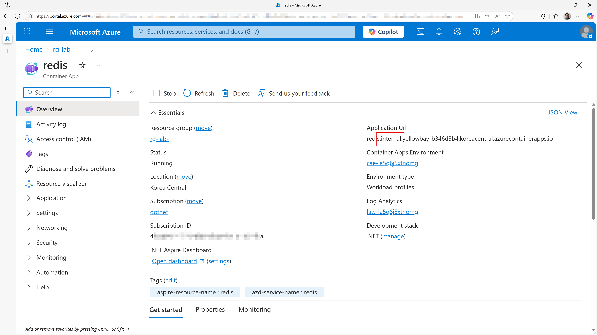

1. Click the Container Apps instance, **pg-products**, again notice the word **internal** in the **Application Url** value.

   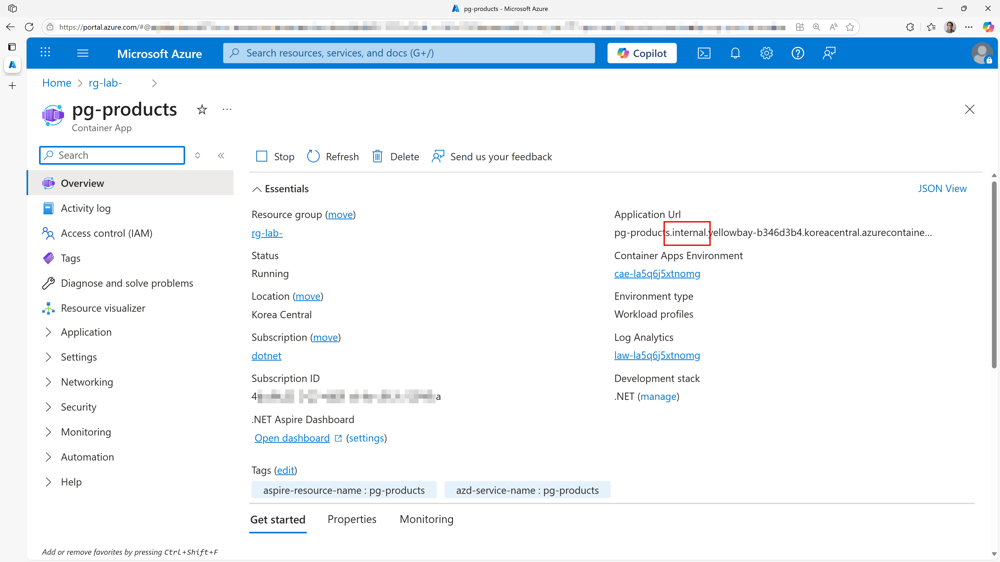

   Check out the other Container Apps instance, **pg-storeinfo** and find the **internal** in the **Application Url** string.

1. Click the Container Apps instance, **eshoplite-products**, again notice the word **internal** in the **Application Url** value.

   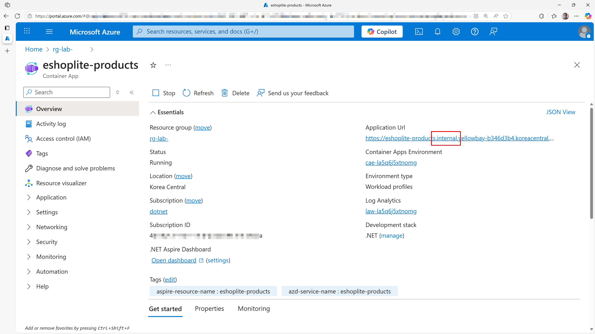

   When you actually navigate to the **eshoplite-products** API app, it will give you the 404 error.

   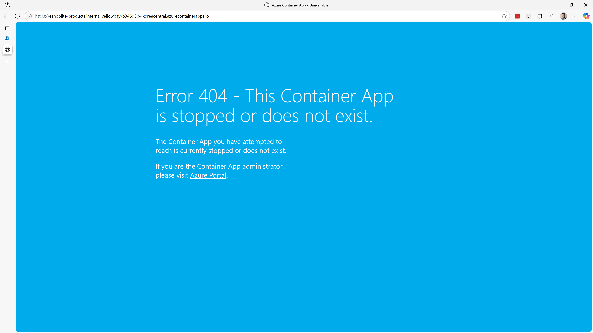

   Check out the other Container Apps instance, **eshoplite-storeinfo** and find the same result as **eshoplite-products**.

1. Click the Container Apps instance, **eshoplite-store**, and note that **Application Url** does NOT contain the word **internal**. The store website is available to the Internet.

   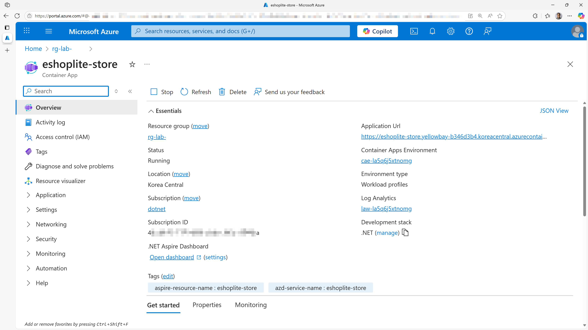

1. Navigate to the **eshoplite-store** app, browse to both **Products** and **Stores**, and verify the web app is up and running.

### Inspecting the deployment with Aspire CLI

1. Switch back to the terminal.
1. Describe the deployed resources.

    ```powershell
    aspire describe
    ```

    This shows the resources Aspire knows about, including their state, health, and endpoints.

1. If you want to capture diagnostics from the running deployment, export them.

    ```powershell
    aspire export --output .\aspire-output\aca-deployment-export.zip
    ```

    The exported zip can include resource metadata, console logs, structured logs, and traces that are useful for troubleshooting or for sharing deployment results with your team.

### Adding a custom domain name

After deploying, the **eshoplite-store** container app receives an auto-generated Azure URL. To use your own domain:

1. In the Azure Portal, navigate to your **eshoplite-store** Container App.
1. Select **Settings > Custom domains** from the left menu.
1. Click **Add custom domain**, enter your domain name, and follow the prompts to verify ownership with a DNS TXT record.
1. Once verified, add a CNAME (or A record for apex domains) pointing to the Container App's auto-generated URL.
1. Azure Container Apps provides a free managed TLS certificate automatically — no additional configuration is needed.

> **NOTE**: Custom domain configuration is done through the Azure Portal or Azure CLI (`az containerapp hostname add`). The Aspire CLI does not manage custom domains directly.

### Cleaning up resources

1. To delete all the Azure resources created by the deployment, run the following command:

    ```powershell
    aspire destroy
    ```

1. Review the resources Aspire plans to remove, then confirm the prompt.
1. If you need a non-interactive cleanup, use `aspire destroy --yes`.


## ✅ Verification

By the end of this section, you should have:

🔹 Deployed the application to Azure Container Apps  
🔹 Inspected deployed resources with Aspire CLI  
🔹 Exported deployment diagnostics for troubleshooting  
🔹 Learned how to add a custom domain to your deployed app  

---
[← Previous: Add Redis Caching](../6-add-redis-caching/README.md) | [Next: Add AI Capabilities →](../8-add-ai-capabilities/README.md)